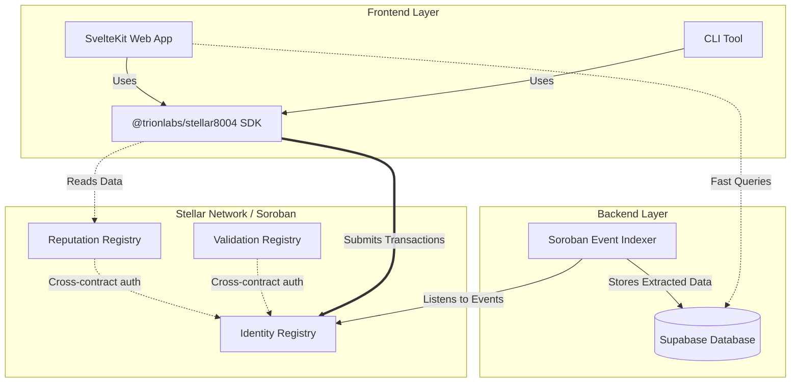

# Technical Reference

Architecture, spec coverage, EVM divergences, and event layouts for the Stellar 8004 contracts.

## Architecture

Three layers: on-chain contracts, off-chain indexer, and client-side SDK/frontend.

### Smart Contracts

Written in Rust for Soroban. All three have timelocked upgrades (3-day delay) and OZ 2-step ownership transfer.

- **Identity Registry** - Agent NFTs, metadata key-value storage, wallet binding. The `agentWallet` reserved key is initialized on register, exposed via `get_metadata`, and flows through `MetadataSet` events. Transfer clears wallet and all metadata.
- **Reputation Registry** - Feedback with on-chain self-feedback prevention via `is_authorized_or_owner`. Stores value, decimals, and two filter tags. `get_summary` returns the normalized average over an explicit client list. Empty list reverts (Sybil prevention).
- **Validation Registry** - Third-party attestation. Validators respond with 0-100 scores and can issue progressive updates.

### Backend

- **Event Indexer** - Supabase Edge Function that watches Soroban contract events, parses them, and writes to Postgres. Handles both current and legacy event formats.
- **Supabase** - Postgres with materialized views for leaderboard scoring, RPC functions for search with owner filtering, and atomic rate limiting.

### Frontend and SDK

- **SDK** (`@trionlabs/stellar8004`) - TypeScript library with contract bindings, Freighter wallet signer, and explorer API client. Single source of truth for contract addresses in `config.ts`.
- **Web App** (`stellar8004.com`) - SvelteKit explorer for browsing agents, submitting feedback, requesting validations, and managing agent registrations.
- **CLI** - Command-line tool for agents to register themselves directly.
- **Skills** - `/8004s` and `/x402s` for AI-assisted development.

## Spec Coverage

Compared against the [8004 reference contracts](https://github.com/erc-8004/erc-8004-contracts) (`master`, 2026-04-08).

| Registry | Spec Functions | Implemented | Partial / Missing |
|----------|----------------|-------------|-------------------|
| Identity | 11 | All 11 | - |
| Reputation | 10 | 8 | `readAllFeedback` off-chain only (explorer HTTP endpoint). `getResponseCount` no `responders[]` filter. `getClients` paginated. |
| Validation | 7 | All 7 | `getAgentValidations` and `getValidatorRequests` paginated. |

Soroban-only additions: `extend_ttl`, `propose_upgrade` / `execute_upgrade` / `cancel_upgrade` / `pending_upgrade` (3-day timelocked upgrades), `version`, `find_owner`, `agent_exists`, `total_agents`, `request_exists`, `token_uri` override, metadata size caps (64B key / 4KB value / 100 keys). OZ 2-step ownership: `get_owner`, `transfer_ownership`, `accept_ownership`, `renounce_ownership`.

## Differences from the EVM Reference

All spec functions are implemented with equivalent behavior. Differences are inherent to Soroban or intentional hardening.

**Runtime constraints:**

| What | EVM | Soroban |
|------|-----|---------|
| `setAgentWallet` auth | EIP-712 / ERC-1271 signature + deadline | `require_auth()` on both caller and wallet (native, no replay) |
| `getClients` / `getAgentValidations` / `getValidatorRequests` | Returns full array | Paginated `*_paginated(start, limit)` (per-tx read budget ~100 entries) |
| `readAllFeedback` | On-chain, returns 7 parallel arrays | Off-chain: explorer HTTP `/api/v1/agents/:id/feedback` wrapped by SDK `ExplorerClient.getFeedback()` |
| `getSummary` client cap | Unbounded | Hard-capped at 5 clients per call |
| Function overloading | `register()`, `register(uri)`, `register(uri, metadata)` | Three named functions: `register`, `register_with_uri`, `register_full` |
| `getResponseCount` | Accepts `responders[]` filter | Total count only; per-responder filtering via `ResponseAppended` events |

**Security hardening (stricter than spec):**

- Transfer clears ALL metadata (spec only clears `agentWallet`). Prevents a previous owner's claims from persisting.
- Metadata size caps: 64-byte keys, 4KB values, 100 keys per agent.

**Type adaptations:**

| Spec type | Soroban type | Notes |
|-----------|-------------|-------|
| `uint8` | `u32` | Soroban `#[contracttype]` has no `u8` |
| `uint256 agentId` | `u32` | OZ Stellar NFT uses u32 (~4B agents) |
| `int128 value` | `i128` | Native |
| `uint64 feedbackIndex` | `u64` | Native |
| `uint256 lastUpdate` | `u64` | Ledger sequence |
| `address` | `Address` | Covers both G-accounts and C-contracts |
| `abi.encodePacked(address)` | StrKey ASCII (56 bytes) | `agentWallet` metadata encoding |
| `int256` intermediate | `i128` | Overflow at \|value\| > ~1.7e20 with decimals=0; returns `AggregateOverflow` cleanly |

**Naming:** All functions are snake_case per Rust convention. Event indexed string topics are literal Soroban strings (not keccak256 hashes as in Solidity).

## Event Topic Positions

Indexed fields appear in the topic array (positions 1..n), not the data body.

| Event | Topics | Body |
|-------|--------|------|
| `Registered` | `agent_id`, `owner` | `agent_uri` |
| `UriUpdated` | `agent_id`, `updated_by` | `new_uri` |
| `MetadataSet` | `agent_id`, `key` | `value` (wallet writes use `key="agentWallet"`) |
| `NewFeedback` | `agent_id`, `client_address`, `tag1` | remaining fields |
| `FeedbackRevoked` | `agent_id`, `client_address`, `feedback_index` | empty |
| `ResponseAppended` | `agent_id`, `client_address`, `responder` | remaining fields |
| `ValidationRequest` | `validator_address`, `agent_id`, `request_hash` | `request_uri` |
| `ValidationResponse` | `validator_address`, `agent_id`, `request_hash` | remaining fields |
